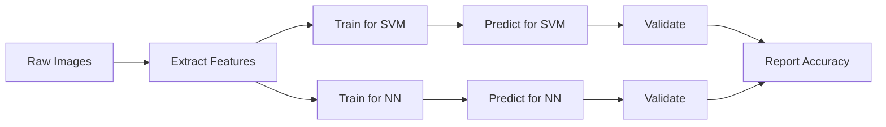

# Final Project

## Comparison of Linear SVM and Neural Network for Image Classification

### Models Compared - Linear SVM vs Neural Network

**Model Implementation:** Python with the scikit-learn ML library will be used. `LinearSVC` for Linear SVM
and `MLPClassifier` for the Neural Network.

**Model Parameters:**

- For Linear SVM, the regularization parameter C will be tested at $0.01, 0.1, 1, 10, 100$, with the best value selected using cross-validation.
- For the Neural Network, the `MLPClassifier` will use one single hidden layer with $20, 100$ nodes, and learning rates of $0.001, 0.01, 0.1$ will be evaluated using cross-validation.

### Dataset - STL-10

- **Dataset Source:** Stanford AI Lab - https://cs.stanford.edu/~acoates/stl10/
- **Dataset Type:** Image classification dataset containing 96 × 96 RGB images.
- **Dataset Size:** The dataset contains 13,000 labeled images - 5,000 training images + 8,000 test images.
- **Classes:** 10 labeled object categories: airplane, bird, car, cat, deer, dog, horse, monkey, ship, and truck.
- **Features Used:** The RGB image will be flattened into one feature vector, which will be used as input for both models. _The unlabeled images included with STL-10 are ignored for this project_.

### Accuracy Metric

- **Primary Evaluation Metric:** Classification accuracy will be the primary evaluation metric.
- **Calculation:** Accuracy = Number of correctly classified samples / Total number of samples. If data is imbalanced, balanced accuracy will be implemented to correct accuracy of results.
  Training runtime will also be recorded for each model to compare computational efficiency.

### Experiment

**Cross-Validation:** 5-fold cross-validation will be used to evaluate the models and select model parameters.

The same cross-validation folds and preprocessing procedure will be used for both Linear SVM and the Neural Network to provide a consistent comparison. The final selected models will then be evaluated on the STL-10 test set. Training runtime will be measured for both models and compared with their classification accuracy.

---

## Dataset Analysis

The [**STL-10**](https://cs.stanford.edu/~acoates/stl10/) dataset is an image recognition dataset for developing unsupervised feature learning, deep learning, self-taught learning algorithms.

### Image Classes

- 10 classes: airplane, bird, car, cat, deer, dog, horse, monkey, ship, truck.
- Images are 96x96 pixels, color.
- 500 training images (10 pre-defined folds), 800 test images per class.
- 100000 unlabeled images for unsupervised learning. These examples are extracted from a similar but broader distribution of images. For instance, it contains other types of animals (bears, rabbits, etc.) and vehicles (trains, buses, etc.) in addition to the ones in the labeled set

For the purpose of this classification vs NN, we'll only use the 5,000 labeled training images & 8,000 test images.

### Binary Files

- The binary files are split into data and label files with suffixes: `train_X.bin`, `train_y.bin`, `test_X.bin` and `test_y.bin`. Within each, the values are stored as tightly packed arrays of uint8's. The images are stored in column-major order, one channel at a time. That is, the first 96*96 values are the red channel, the next 96*96 are green, and the last are blue. The labels are in the range 1 to 10. The unlabeled dataset, `unlabeled.bin`, is in the same format, but there is no `_y.bin` file.
- A `class_names.txt` file is included for reference, with one class name per line.
- The file `fold_indices.txt` contains the (zero-based) indices of the examples to be used for each training fold. The first line contains the indices for the first fold, the second line, the second fold, and so on.

The dataset is ~ 2.5GB, download the [binary files](http://ai.stanford.edu/~acoates/stl10/stl10_binary.tar.gz) from original source. The `unlabeled.bin` is the largest dataset and ignored.

> All `.bin` files are ignored from being committed, the `.bin` file sizes are between 150 MB to 250MB, GitHub does not allow uploads above 100MB.
>
> ```
> remote: error: File project/stl-10/test_X.bin is 210.94 MB; this exceeds GitHub's file size limit of 100.00 MB
> remote: error: File project/stl-10/train_X.bin is 131.84 MB; this exceeds GitHub's file size limit of 100.00 MB
> ```

## High Level Approach 

GitHub does not allow to render mermaid diagrams in python notebooks!



### Experiments
Brute force approach to identify `C` and `max_iter` threw me in a tizzy. "There should be better way to identify the best $C$"

> Note: Running a cartesian product of all ImageCounts, Cs and Iterations is a bad idea. 
> ```
> # Let's see how much data is needed, beyond which it is a point of diminishing returns.
> imgs = [500, 1000, 2000, 3000, 4000, 5000]
> cs = [0.01, 0.1, 1, 10, 100]
> iters = [10000]
> experiments = list(product(imgs, iters, cs))
> 
> df = pd.DataFrame([linear(ic, itr, c) for ic, itr, c in experiments])
> display(df)
> ```

The above combination generated 30 experiments, running over 900 minutes ~ 15 hours!!

After 700 minutes, I was in "The Sunk Cost Fallacy" land. Since I had burnt through so much processing power, I decided to let the program complete. This blocked all my other tests. 

```
    # The answer to the great question of Life, the Universe and Everything is always forty-two
    random_state = 42
```

### Layout

The project is split into individual components, as running each file is going to get expensive (time is money) pretty soon! 

```project/
├── 00-project-ds675.ipynb
├── 01-linear-svm.ipynb
├── 02-mlp-classifier.ipynb
├── 03-cnn.ipynb
├── shared_library.py            # loaders, paths, helpers (shared code)
├── stl-10-dataset-viewer.ipynb
├── stl-10/                      # train_X.bin, etc.
└── results/                     # one CSV per model
```
The results are exported as CSV files under `results` folder. If I just keep them in `DataFrame` and the kernel dies, I lose my experiment results. 

Still debating between `papermill` and manual execution.

