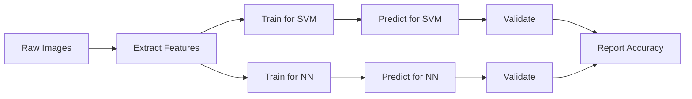

# Final Project Notebook

> Last Day to submit dataset selection is October 7th

## Useful Links
* [Linear Models](https://scikit-learn.org/stable/modules/linear_model.html)
* [Support Vector Machines](https://scikit-learn.org/stable/modules/svm.html)

The idea is to evaluate classifiers 

### Getting Started 

* Simple SVM file, modify to do Linear Regression
* Compare Linear Models or Neutral Network vs Linear Models
* Work on the one pager

### Project Work
Comparison of two models in test accuracy and training runtime

* Pick two models
* Pick two medium to large datasets
* Perform cross validation

**Linear models**: Linear Regression and Support Vector Machine
**Non-linear models**: Neural Networks

#### Data Sources

* [UC Irvine Machine Learning Repository](https://archive.ics.uci.edu/) - https://archive.ics.uci.edu/
* [Kaggle](https://www.kaggle.com/) - https://www.kaggle.com/
* [Google Datasets](https://datasetsearch.research.google.com/) - https://datasetsearch.research.google.com/
* [Papers with code](https://paperswithcode.com/) - https://paperswithcode.com/

####  Problem domains
* Image Classification - popular benchmarks are CIFAR10, CIFAR100, IMAGENET, STL10, MNIST
* Video Classification
* Image Segmentation
* Image Localization
* Tabular Data - business data such as insurance, time series data

Email the one pager,
Request a meeting to discuss meeting

#### Presentation 
Final Presentation is a Powerpoint Slide with results and code

## High Level Approach 

GitHub does not allow to render mermaid diagrams in python notebooks!

